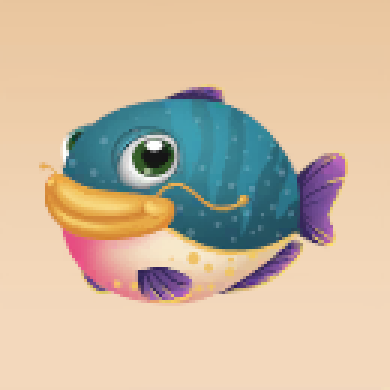
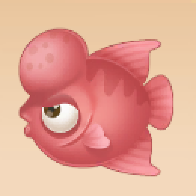
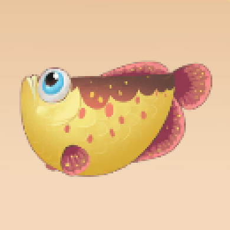
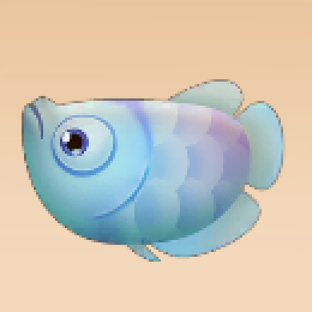
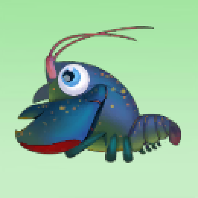
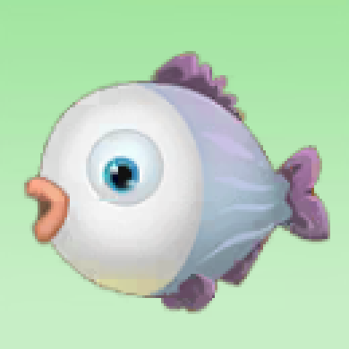

# moer

> 摩尔庄园攻略收集中...

## 动物

| 图谱位置 | 名称 | 缩略图 | 获取方式 | 出现地点 | 出现时间 | 描述
|:------|:------|:-------|:--------|:--------|:--------|:--------|
| 1 | 母鸡幼崽 |   | 牧场商店 | | | 小母鸡头小脚短，身体比较圆，走路时分叉的哦！ |
| 5 | 母鸡成面 |   | 家园饲养 | | | 母鸡母鸡咯咯哒，鸡肉鸡肉都好吃~ |
| 9 | 鲤鱼 |   | 钓鱼 | 家园池塘、雪山鱼池 | 全天 | 鲤鱼的嘴巴可以伸出来,且嘴边长有触须，会在泥浆中翻找食物。 |
| 11 | 冰川虾 |   | 钓鱼 | 拉菲雪山 | 全天 | 冰川虾对环境的适应能力非常强，喜欢潜伏于底质之中，仅漏出亮眼和触须暗中观察。 |
| 12 | 鲶鱼 |   | 钓鱼 | 家园池塘、雪山鱼池 | 全天 | 鲶鱼怕光，喜欢生活在水底缝隙之中，且它的眼小，视力弱，昼伏夜出，全凭嗅觉和两对触须觅食。 |
| 13 | 大闸蟹 |   | 钓鱼 | 家园鱼塘 | 全天 | 家园特产，大闸蟹学名为中华绒螯蟹，它常穴居江、河、湖荡泥岸，并昼伏夜出。 |
| 17 | 彩翅鱼 |   | 钓鱼 | 浆果丛林 | 晴天  | 彩翅鱼是摩尔拉雅雪山上的特有鱼，通体雪白让它和周围的冰雪混为一体，宛如池中的精灵。 |
| 18 | 斑马鱼 |   | 钓鱼 | 浆果丛林 | 全天 | 斑马鱼性情温和，小巧玲珑，几乎终日不停的游动，十分的活泼。 |
| 19 | 罗汉鱼 |   | 钓鱼 | 浆果丛林 | 全天 | 罗汉鱼是一种观赏鱼，其头顶的大鼓包让它的外形显得与众不同。 |
| 21 | 红麟鱼 |   | 钓鱼 | 家园池塘、雪山鱼池 | 雨天 | 红麟鱼是冷水性语种，红色的鳞片让它额外的引人注目。 |
| 30 | 冰川红虾 |   | 钓鱼 | 拉雅雪山 | 全天 | 冰川红虾生命力强以捕食底栖生物为主，喜欢傍晚或者清晨活动觅食。 |
| 31 | 紫色鲶鱼 |   | 钓鱼 | 拉雅雪山 | 全天 | 紫色鲶鱼喜欢生活在江河进岸的石缝、深坑、树根底部的树洞，不同于普通鲶鱼，它在入冬后仍有着频繁的活动。 |
| 32 | 利齿狗鱼 |   | 钓鱼 | 家园池塘、雪山鱼池 | 全天 | 利齿狗鱼拥有比其他狗鱼更锋利的牙齿，是淡水中最凶猛的鱼类。 |
| 39 | 礼服鱼 |   | 钓鱼 | 浆果丛林 | 夜晚 | 礼服鱼是一种观赏鱼，形态优雅，酷似礼服。 |
| 40 | 幻彩鱼 |   | 钓鱼 | 浆果丛林 | 夜晚 | 夜间触摸的热带雨中，拥有迷幻而妖艳的颜色，传说他有过的地方都会都呈现荧光色。 |
| 43 | 芭蕾鱼 |   | 钓鱼 | 浆果丛林、家园池塘 | 全天 | 芭蕾鱼属于热带鱼种，由于其曼妙的游动姿态，从而有了芭蕾鱼之称，是不可多得的水中舞者。 |
| 44 | 银龙鱼 |   | 钓鱼 | 浆果丛林、家园池塘 | 全天 | 银龙鱼外形酷似古代的龙，并且全身鳞片为银色而命名，是大型肉食类鱼类。以鱼、虾、贝为食。 |
| 45 | 水蜘蛛 |   | 钓鱼 | 家园池塘、浆果丛林 | 雨天 | 水蜘蛛是其同类的唯一叛逆者——生活在谁水的世界，善于在水生植物之间吐丝结网以捕食水面的小动物为生。 |
| 49 | 鲟鱼 |   | 钓鱼 | 拉菲雪山 | 全天 | 鲟鱼是现存起源最早的脊椎动物之一，他的历史可以追溯到恐龙时代，素有“水中活化石”之称。 |
| 50 | 雪鱼 |   | 钓鱼 | 拉菲雪山 | 晴朗白天 | 雪鱼产于雪山上游，其肉成爪子瓣，富有油脂，鲜嫩异常，历来被视为家中之珍品。 |
| 51 | 抱抱熊 |   | 钓鱼 | 拉菲雪山 | 晴朗白天 | 雪山鱼池特有的罕见生物，因常年生活在冰天雪地，身上毛发自然形成了保护罩，感觉像穿了小背心。 |
| 52 | 美美鱼 |   | 钓鱼 | 家园池塘、雪山鱼池 | 全天 | 鱼影看似美丽动人实则十分凶狠，是肉食性鱼种，一旦被咬住就不会轻易松口。 |
| 53 | 鳖虾 |   | 钓鱼 | 家园池塘、雪山鱼池 | 夜晚 | 鳖虾主要栖于淡水，喜阴怕光，光线微弱或黑暗时爬出洞穴，通常抱住水体中的水草或悬浮物，呈”睡觉“状。 |
| 55 | 眉毛鱼 |   | 钓鱼 | 家园池塘、雪山鱼池 | 全天 | 一种不畏惧寒冷的鱼，体型较小的它们成群结队的出现，一旦当它们遇到危机时，它们将会聚集在一起形成一个护盾，很难攻破。 |
| 56 | 胖头鱼 |   | 钓鱼 | 家园池塘、雪山鱼池 | 全天 | 胖头鱼生活在江河干流，平缓的河湾、湖泊以及水库的中上层，性情温顺，行动迟缓，以浮游生物为食。 |

## 植物

| 名称 | 缩略图 | 获取方式 | 描述
|:------|:-------|:--------|:--------|

## 菜谱

| 名称 | 缩略图 | 获取方式 | 描述 
|:------|:-------|:--------|:--------|

## 贡献

为了方便文档本身的易读性，请严格按照以下方式提交PR:
1. 图片裁剪：缩略图(390x390), 详情图(1440x1035)
2. 图片命名：[资源类型]_[排序]_[图片类型(1缩略图2详情图)].png
