# moer

> 摩尔庄园攻略收集中...

## 动物

||||||
|:------|:------|:-------|:--------|:--------|
||||||
|||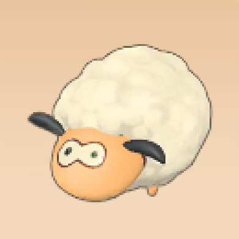|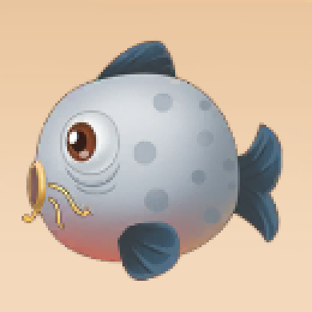||
||||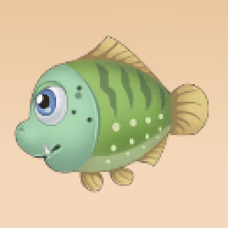||
||||||
||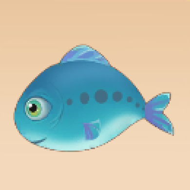|||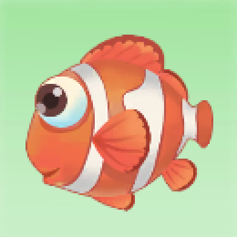|
||||||
||||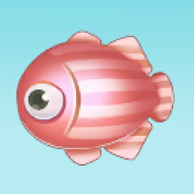||
||||||
||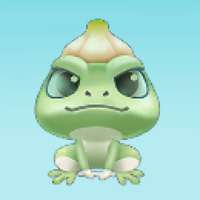||||
||||||
||||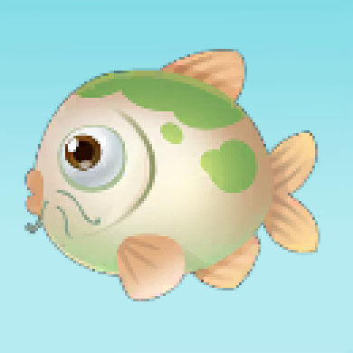|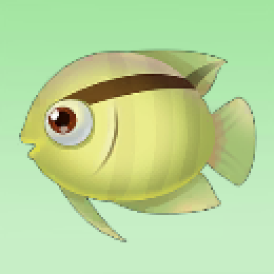|
|||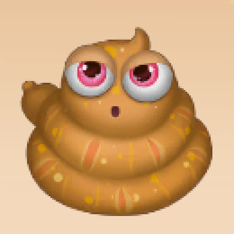|||
||||||
||||||
||||||

| 图谱位置 | 名称 | 缩略图 | 获取途径 | 出现地点 | 出现时间 | 描述
|:------|:------|:-------|:--------|:--------|:--------|:--------|
| 1 | 母鸡幼崽 |   | 牧场商店 | | | 小母鸡头小脚短，身体比较圆，走路时分叉的哦！ |
| 2 | 鸭子幼崽 |   | 牧场商店 | | | 今天也要加油长大鸭！ |
| 3 | 奶牛幼崽 |   | 牧场商店 | | | 哞哞~小奶牛也很喜欢喝牛奶呢！  |
| 4 | 绵羊幼崽 |   | 牧场商店 | | | 羊羊羊~真暖和！ |
| 5 | 母鸡成年 |   | 家园饲养 | | | 母鸡母鸡咯咯哒，鸡肉鸡肉都好吃~ |
| 6 | 鸭子成年 |   | 家园饲养 | | | 鸭的眼睛有360度视角，不用转头就可以看到身后的鸭！ |
| 7 | 母牛成年 |   | 家园饲养 | | | 不是每一种牛奶都叫mole奶~ |
| 8 | 绵羊成年 |   | 家园饲养 | | | 和多莉是同一个品种唷！|
| 9 | 鲤鱼 |   | 钓鱼 | 家园池塘、雪山鱼池 | 全天 | 鲤鱼的嘴巴可以伸出来,且嘴边长有触须，会在泥浆中翻找食物。 |
| 10 | 小龙虾 |   | | | |  |
| 11 | 冰川虾 |   | 钓鱼 | 拉菲雪山 | 全天 | 冰川虾对环境的适应能力非常强，喜欢潜伏于底质之中，仅漏出亮眼和触须暗中观察。 |
| 12 | 鲶鱼 |   | 钓鱼 | 家园池塘、雪山鱼池 | 全天 | 鲶鱼怕光，喜欢生活在水底缝隙之中，且它的眼小，视力弱，昼伏夜出，全凭嗅觉和两对触须觅食。 |
| 13 | 大闸蟹 |   | 钓鱼 | 家园鱼塘 | 全天 | 家园特产，大闸蟹学名为中华绒螯蟹，它常穴居江、河、湖荡泥岸，并昼伏夜出。 |
| 14 | 狗鱼 |   | | | |  |
| 15 | 河豚 |   | 钓鱼 | 阳光牧场神秘湖 | 全天 | 河豚的牙齿很坚固，可以咬碎极硬的贝壳，受到危险时会吸气膨胀自身，吓退掠食者。 |
| 16 | 桂花鱼 |   | | | |  |
| 17 | 彩翅鱼 |   | 钓鱼 | 浆果丛林 | 晴天  | 彩翅鱼是摩尔拉雅雪山上的特有鱼，通体雪白让它和周围的冰雪混为一体，宛如池中的精灵。 |
| 18 | 斑马鱼 |   | 钓鱼 | 浆果丛林 | 全天 | 斑马鱼性情温和，小巧玲珑，几乎终日不停的游动，十分的活泼。 |
| 19 | 罗汉鱼 |   | 钓鱼 | 浆果丛林 | 全天 | 罗汉鱼是一种观赏鱼，其头顶的大鼓包让它的外形显得与众不同。 |
| 20 | 魟鱼 |   | 钓鱼 | 阳光牧场神秘湖 | 全天 | 魟鱼常常会把身体隐藏在沙地之中，多以小鱼及沙泥地的甲壳类和低栖动物为食。 |
| 21 | 红麟鱼 |   | 钓鱼 | 家园池塘、雪山鱼池 | 雨天 | 红麟鱼是冷水性语种，红色的鳞片让它额外的引人注目。 |
| 22 | 沙丁鱼 |   | 钓鱼 | 阳光牧场神秘湖 | 全天 | 通体银色细细长长的沙丁鱼，由于游动迅速，在水中就像银线一样。 |
| 23 | 鲳鱼 |   | 钓鱼 | 阳光牧场神秘湖 | 全天 | 扁扁的鲳鱼，由于特异的体型，在水中就像一个小盘子一样。 |
| 24 | 带鱼 |   | 钓鱼 | 阳光牧场神秘湖 | 夜晚 | 带鱼游泳能力差，白天浮在海水中层，晚上就降到海底，游动时不断用鳍划水，通过变动身体来向上游动。 |
| 25 | 小丑鱼 |   | 钓鱼 | 阳光牧场神秘湖 | 全天 | 小丑鱼身体上有一层特殊的保护粘液。可让其在海葵中自由移动。 |
| 26 | 章鱼 |   | 钓鱼 | 阳光牧场神秘湖 | 全天 | 章鱼是一种十分聪明的动物，它特别喜欢躲藏在各种器皿之中。 |
| 27 | 琵琶鱼 |   | 钓鱼 | 阳光牧场神秘湖 | 全天 | 琵琶鱼喜欢潜伏在海底，通过头上的小灯笼吸引猎物，待猎物靠近后再一口吞下。 |
| 28 | 怪怪鱼 |   | 钓鱼 | 阳光牧场神秘湖 | 夜晚 | 在牧场海中无意发现的特有鱼种。颜色艳丽却非常狡猾，想钓到它可不是那么容易的。 |
| 29 | 锦鲤 |   | | | |  |
| 30 | 冰川红虾 |   | 钓鱼 | 拉雅雪山 | 全天 | 冰川红虾生命力强以捕食底栖生物为主，喜欢傍晚或者清晨活动觅食。 |
| 31 | 紫色鲶鱼 |   | 钓鱼 | 拉雅雪山 | 全天 | 紫色鲶鱼喜欢生活在江河进岸的石缝、深坑、树根底部的树洞，不同于普通鲶鱼，它在入冬后仍有着频繁的活动。 |
| 32 | 利齿狗鱼 |   | 钓鱼 | 家园池塘、雪山鱼池 | 全天 | 利齿狗鱼拥有比其他狗鱼更锋利的牙齿，是淡水中最凶猛的鱼类。 |
| 33 | 硬刺桂花鱼 |   | | | |  |
| 34 | 变异斑马鱼 |   | 钓鱼 | 浆果丛林 | 全天 | 变异斑马鱼比一般的斑马鱼体型要略大，红色的花纹让它更容易分辨。 |
| 35 |  |   | | | |  |
| 36 | 金鱼 |   | | | |  |
| 37 | |   | | | |  |
| 38 | 枫叶鱼 |   | | | |  |
| 39 | 礼服鱼 |   | 钓鱼 | 浆果丛林 | 夜晚 | 礼服鱼是一种观赏鱼，形态优雅，酷似礼服。 |
| 40 | 幻彩鱼 |   | 钓鱼 | 浆果丛林 | 夜晚 | 夜间触摸的热带雨中，拥有迷幻而妖艳的颜色，传说他有过的地方都会都呈现荧光色。 |
| 41 | 水蛇 |   | 钓鱼 | 家园池塘、浆果丛林 | 全天 | 水蛇生活在水里，是半水栖动物，五毒，会以咬杀的方式捕食鱼和两栖动物。 |
| 42 | 蒜头蛙 |   | 钓鱼 | 家园池塘、浆果丛林 | 全天 | 蒜头蛙常生活于稻田、池塘、沼泽等有水的地方，其栖息地随着觅食、繁殖、越冬等不同的生活时期而改变。 |
| 43 | 芭蕾鱼 |   | 钓鱼 | 浆果丛林、家园池塘 | 全天 | 芭蕾鱼属于热带鱼种，由于其曼妙的游动姿态，从而有了芭蕾鱼之称，是不可多得的水中舞者。 |
| 44 | 银龙鱼 |   | 钓鱼 | 浆果丛林、家园池塘 | 全天 | 银龙鱼外形酷似古代的龙，并且全身鳞片为银色而命名，是大型肉食类鱼类。以鱼、虾、贝为食。 |
| 45 | 水蜘蛛 |   | 钓鱼 | 家园池塘、浆果丛林 | 雨天 | 水蜘蛛是其同类的唯一叛逆者——生活在谁水的世界，善于在水生植物之间吐丝结网以捕食水面的小动物为生。 |
| 46 | 鸭嘴怪怪 |   | 钓鱼 |  |  |  |
| 47 |  |   | 钓鱼 |  |  |  |
| 48 | 肥头鹅 |   | 钓鱼 | 拉菲雪山 | 全天 | 肥头鹅因为体内脂肪比较多所以极其抗寒，常出没在冰天雪地的地方，以捕食小鱼为食。 |
| 49 | 鲟鱼 |   | 钓鱼 | 拉菲雪山 | 全天 | 鲟鱼是现存起源最早的脊椎动物之一，他的历史可以追溯到恐龙时代，素有“水中活化石”之称。 |
| 50 | 雪鱼 |   | 钓鱼 | 拉菲雪山 | 晴朗白天 | 雪鱼产于雪山上游，其肉成爪子瓣，富有油脂，鲜嫩异常，历来被视为家中之珍品。 |
| 51 | 抱抱熊 |   | 钓鱼 | 拉菲雪山 | 晴朗白天 | 雪山鱼池特有的罕见生物，因常年生活在冰天雪地，身上毛发自然形成了保护罩，感觉像穿了小背心。 |
| 52 | 美美鱼 |   | 钓鱼 | 家园池塘、雪山鱼池 | 全天 | 鱼影看似美丽动人实则十分凶狠，是肉食性鱼种，一旦被咬住就不会轻易松口。 |
| 53 | 鳖虾 |   | 钓鱼 | 家园池塘、雪山鱼池 | 夜晚 | 鳖虾主要栖于淡水，喜阴怕光，光线微弱或黑暗时爬出洞穴，通常抱住水体中的水草或悬浮物，呈”睡觉“状。 |
| 54 | 绿鲤鱼 |   | 钓鱼 | 家园池塘、雪山鱼池 | 全天 | 用秋翠锦鲤与黄金锦鲤杂交成的，每五万颗卵之中能孵化出5到6条，可说是万中无一。 |
| 55 | 眉毛鱼 |   | 钓鱼 | 家园池塘、雪山鱼池 | 全天 | 一种不畏惧寒冷的鱼，体型较小的它们成群结队的出现，一旦当它们遇到危机时，它们将会聚集在一起形成一个护盾，很难攻破。 |
| 56 | 胖头鱼 |   | 钓鱼 | 家园池塘、雪山鱼池 | 全天 | 胖头鱼生活在江河干流，平缓的河湾、湖泊以及水库的中上层，性情温顺，行动迟缓，以浮游生物为食。 |
| 57 |  |   | 钓鱼 |  |  |  |
| 58 | 粑粑海肠 |   | 钓鱼 | 阳光牧场神秘湖 | 全天 | 粑粑海肠是一种圆筒形的环节动物，浑身无毛刺，外形似裸体海参，其营养价值比起海参也不逊色。 |
| 59 | 花瓣海胆 |   | 钓鱼 | 阳光牧场神秘湖 | 全天 | 家园特产，花瓣海胆学名为中华绒螯蟹，它常穴居江、河、湖荡泥岸，并昼伏夜出。 |
| 60 | 金枪鱼 |   | 钓鱼 | 阳光牧场神秘湖 | 白天 | 金枪鱼游速非常的快，每小时47km，群游性强，对温度感觉 灵敏，金钱鱼是鱼类中较为喜欢温和天气的一种鱼类 |
| 61 | 初恋海星 |   | 钓鱼 | 阳光牧场神秘湖 | 白天 | 初恋海星食量大，消化能力强 ，主要补食一些行动较为迟缓的海洋生物，起着保护生物群平衡的作用。 |
| 62 | 月亮海螺 |   | 钓鱼 | 阳光牧场神秘湖 | 夜晚 | 月亮海螺活动较慢，常以海藻和细小微生物为食物，一般栖息于浅海海域。它们漂亮的外壳常被用于雕刻观赏。 |
| 63 | 星空鱼 |   | 钓鱼 | 阳光牧场神秘湖 | 夜晚 | 生活在深海的鱼种，很畏惧光，所以一般只有夜晚才会出现。它身上散发出星星点点的光芒，所以被称之为星空鱼。 |
| 64 | |   | | | |  |
| 65 | |   | | | |  |
| 66 | |   | | | |  |
| 67 | |   | | | |  |
| 68 | |   | | | |  |
| 69 | |   | | | |  |
| 70 | |   | | | |  |

甲鱼 全天，家园鱼塘
樱花蛇 白天，阳光牧场神秘湖
许愿龟 下雨的夜晚，雪山鱼池，浆果森林
白白鲸 晴天，雪山鱼池
河童 下雨的白天，浆果森林，家园吃糖
冰淇淋鼠 全天，浆果森林
红鳞鱼 雨天，浆果森林

## 植物

||||||
|:------|:------|:-------|:--------|:--------|
|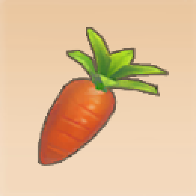|||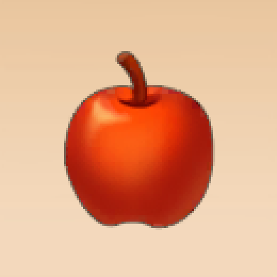||
||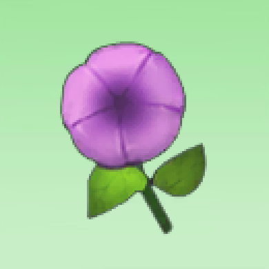|||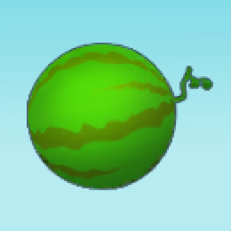|
|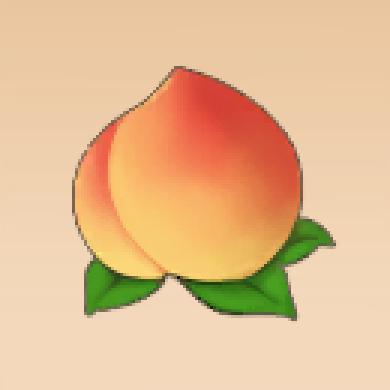|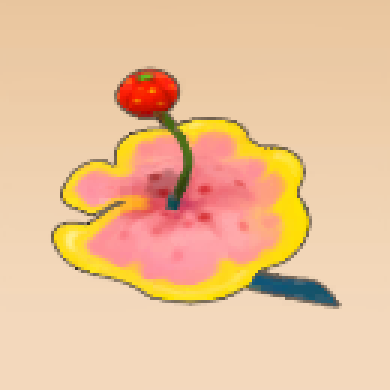||||
||||||
||||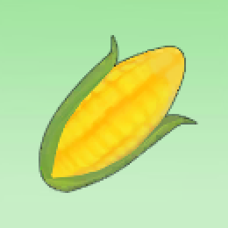||
||||||
|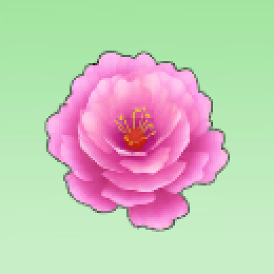|||||
||||||
||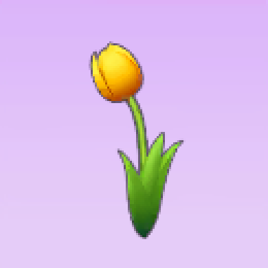||||
||||||

| 图谱位置 | 名称 | 缩略图 | 获取途径 | 成长时间 | 稀有程度 | 最高品质 | 描述 |
|:------|:------|:-------|:--------|:--------|:--------|:--------|:--------|
| 1 | 胡萝卜 |   |  |   |    |    |    |
| 2 | 茄子 |   |  |   |    |    |    |
| 3 | 南瓜 |   |  |   |    |    |    |
| 4 | 苹果 |   |  |   |    |    |    |
| 5 | 草莓 |   |  |   |    |    |    |
| 6 | 香蕉 |   |  |   |    |    |    |
| 7 | 牵牛花 |   |  |   |    |    |    |
| 8 | 小麦 |   |  |   |    |    |    |
| 9 |  |   |  |   |    |    |    |
| 10 | 西瓜 |   |  |   |    |    |    |
| 11 | 水蜜桃 |   |  |   |    |    |    |
| 12 | 毛毛花 |   |  |   |    |    |    |
| 13 | 白菜 |   |  |   |    |    |    |
| 14 |  |   |  |   |    |    |    |
| 15 | 奇异果 |   |  |   |    |    |    |
| 16 |  |   |  |   |    |    |    |
| 17 |  |   |  |   |    |    |    |
| 18 |  |   |  |   |    |    |    |
| 19 | 葡萄 |   |  |   |    |    |    |
| 20 |  |   |  |   |    |    |    |
| 21 |  |   |  |   |    |    |    |
| 22 | 向日葵 |   |  |   |    |    |    |
| 23 |  |   |  |   |    |    |    |
| 24 | 玉米 |   |  |   |    |    |    |
| 25 |  |   |  |   |    |    |    |
| 26 |  |   |  |   |    |    |    |
| 27 |  |   |  |   |    |    |    |
| 28 | 七色花 |   |  |   |    |    |    |
| 29 | 怪怪糖果 |   |  |   |    |    |    |
| 30 |  |   |  |   |    |    |    |
| 31 | 牵牛花 |   |  |   |    |    |    |
| 32 |  |   |  |   |    |    |    |
| 33 |  |   |  |   |    |    |    |
| 34 |  |   |  |   |    |    |    |
| 35 |  |   |  |   |    |    |    |
| 36 |  |   |  |   |    |    |    |
| 37 |  |   |  |   |    |    |    |
| 38 |  |   |  |   |    |    |    |
| 39 |  |   |  |   |    |    |    |
| 40 |  |   |  |   |    |    |    |
| 41 | 薰衣草 |   |  |   |    |    |    |
| 42 | 郁金香 |   |  |   |    |    |    |
| 43 |  |   |  |   |    |    |    |
| 44 |  |   |  |   |    |    |    |
| 45 | 音符re |   |  |   |    |    |    |
| 46 | 音符mi |   |  |   |    |    |    |
| 47 | 音符fa |   |  |   |    |    |    |
| 48 |  |   |  |   |    |    |    |
| 49 |  |   |  |   |    |    |    |
| 50 |  |   |  |   |    |    |    |

## 菜谱

||||||
|:------|:------|:-------|:--------|:--------|
||||||
||||||
||||||
||||||
||||||
||||||
||||||
||||||
||||||
||||||

| 图谱位置 | 名称 | 缩略图 | 获取途径 | 稀有程度 | 所需材料 | 描述 |
|:------|:------|:-------|:--------|:--------|:--------|:--------|
| 1 |  |  |  |   |    |    |    |
| 2 | 胡萝卜盖饭 |  | 研究食谱获得 | 2 | 胡萝卜*2 |    |
| 3 |   |  |  |  |  |    |
| 4 |   |  |  |  |  |    |
| 5 |   |  |  |  |  |    |
| 6 |   |  |  |  |  |    |
| 7 |   |  |  |  |  |    |
| 8 |   |  |  |  |  |    |
| 9 |   |  |  |  |  |    |
| 10 |   |  |  |  |  |    |
| 11 |   |  |  |  |  |    |
| 12 |   |  |  |  |  |    |
| 13 |   |  |  |  |  |    |
| 14 |   |  |  |  |  |    |
| 15 |   |  |  |  |  |    |
| 16 |   |  |  |  |  |    |
| 17 |   |  |  |  |  |    |
| 18 |   |  |  |  |  |    |
| 19 |   |  |  |  |  |    |
| 20 |   |  |  |  |  |    |
| 21 |   |  |  |  |  |    |
| 22 | 奇异炸冰虾 |  |  |  |  |    |
| 23 |   |  |  |  |  |    |
| 24 |   |  |  |  |  |    |
| 25 | 香煎鳕鱼 |  |  |  |  |    |
| 26 |   |  |  |  |  |    |
| 27 | 香蕉牛奶 |  |  |  |  |    |
| 28 | 苹果爆米花 |  |  |  |  |    |
| 29 | 仙桃鲜虾卷 |  |  |  |  |    |
| 30 | 草莓奇异旋风 |  |  |  |  |    |
| 31 | 夏日解暑冰冲 |  |  |  |  |    |
| 32 |   |  |  |  |  |    |
| 33 |   |  |  |  |  |    |
| 34 | 浆果带鱼 |  |  |  |  |    |
| 35 | 葡萄甜浆 |  |  |  |  |    |
| 36 |   |  |  |  |  |    |
| 37 |   |  |  |  |  |    |
| 38 | 杰克南瓜酥 |  |  |  |  |    |
| 39 |   |  |  |  |  |    |
| 40 |   |  |  |  |  |    |
| 41 | 浆果烧饼 |  |  |  |  |    |
| 42 | 拉姆小馒头 |  |  |  |  |    |
| 43 | 烧烤拉姆 |  |  |  |  |    |
| 44 | 夏威夷冰饮 |  |  |  |  |    |
| 45 |   |  |  |  |  |    |
| 46 |   |  |  |  |  |    |
| 47 |   |  |  |  |  |    |
| 48 |   |  |  |  |  |    |
| 49 |   |  |  |  |  |    |
| 50 |   |  |  |  |  |    |
| 51 |   |  |  |  |  |    |
| 52 |   |  |  |  |  |    |
| 53 |   |  |  |  |  |    |
| 54 |   |  |  |  |  |    |
| 55 |   |  |  |  |  |    |
| 56 |   |  |  |  |  |    |
| 57 |   |  |  |  |  |    |
| 58 |   |  |  |  |  |    |
| 59 |   |  |  |  |  |    |

